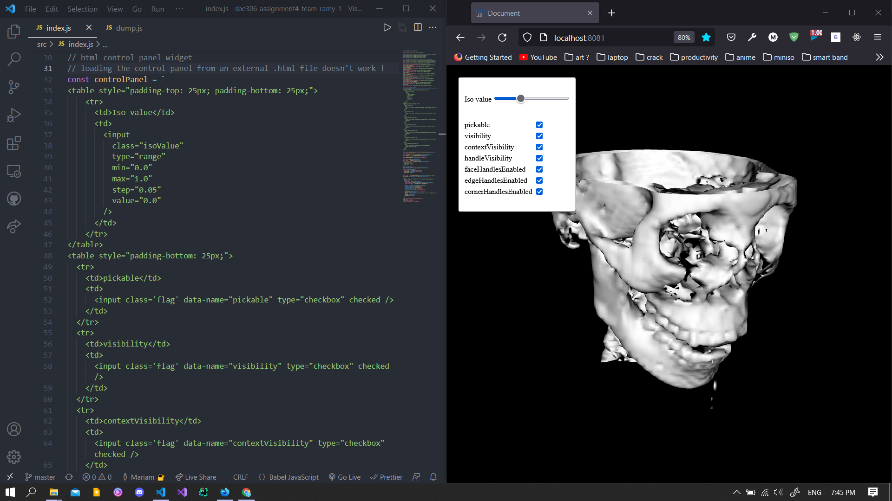
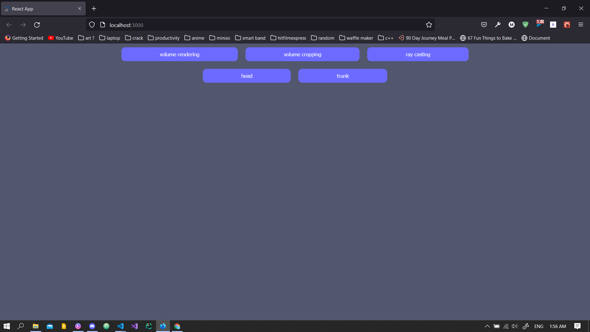
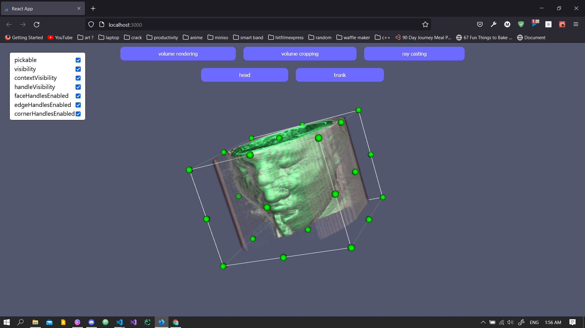
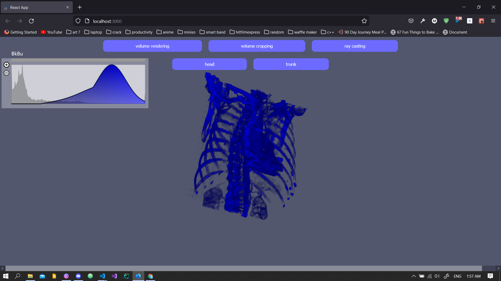

# SBE306 Assignment 4 (VTK) 

### Team members:
- 1 - 26 - Hussein Mohamed Saad AbdElHafez
- 1 - 51 - AbdElRahman Muhsen AbdElLatif AbdElGhany
- 2 - 27 - Mariam Magued Habib Bebawy
- 2 - 51 - Youssef Ahmed MahmoudElSayed Shawky

### To run this web app:
1. clone this repo on your machine.
2. run one of the following commands in this repo's directory `npm start`, `npm run start`, or `yarn start`.

### Files in this repo:
* *data* : Directory containing Head and Ankle datasets
* *public* : .html main file
* *node_modules* : modules used in the web-app implementation
* *src* : .js and .css files
* *img* : progress images
* *others* : dependency files for running and loading

### Features to implement:
> Loading DICOM image series through load button
> Surface rendering with adjustable iso values
> Ray-Casting rendering with a fixed transfer function
> Interactive widget to cut volume in 3 perpendicular planes

***Optional features:***
> Ray-Casting: adjustable transfer function
> Ray-Casting: shift preset

#### Current progress:
- [ ] Loading DICOM image series through load button
      - add button
      - add functionality
- [x] Surface rendering with adjustable iso values
      - ~~add slider~~
      - ~~add functionality~~
- [x] Ray-Casting rendering with a fixed transfer function
      - ~~add transfer function widget~~
      - ~~add functionality~~
- [x] Interactive widget to cut volume in 3 perpendicular planes
      - ~~add widget~~
      - ~~add functionality~~

#### Progress documentation
****not*** using reactjs*

  
*currently using reactjs*

